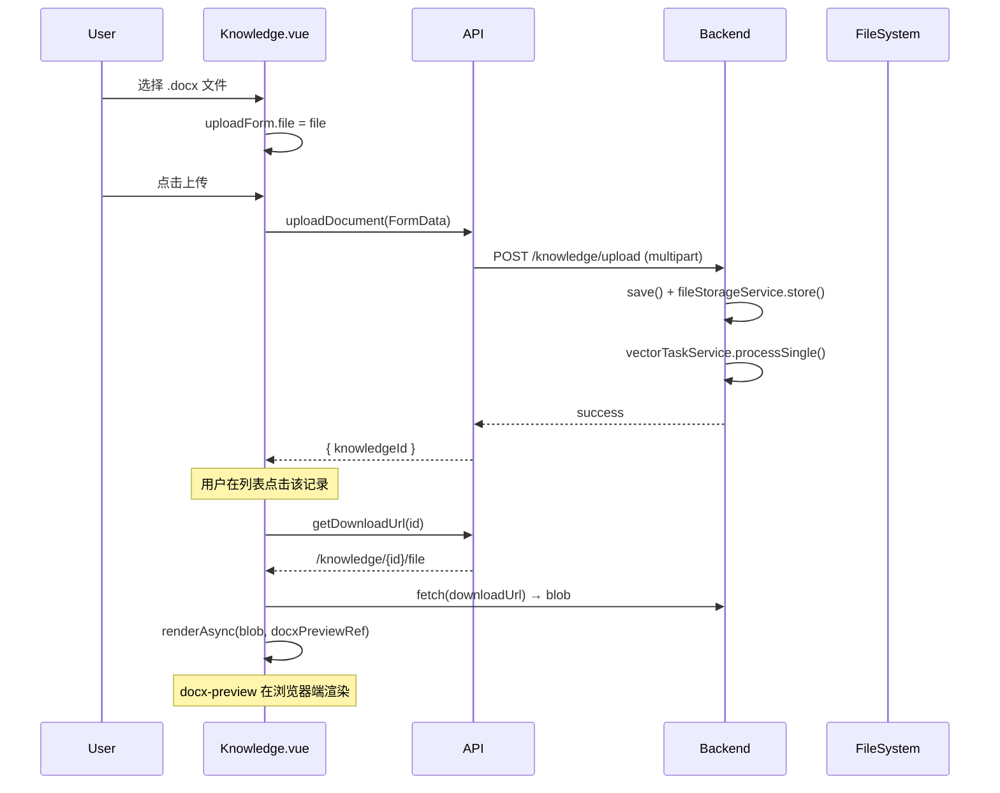
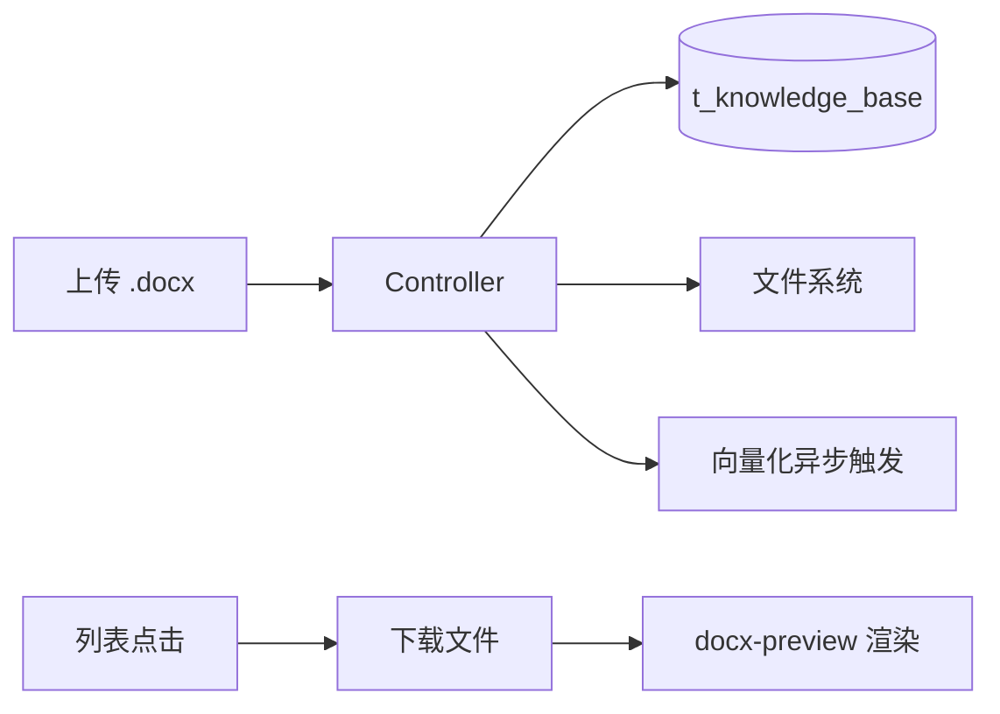

# Word 文档在线预览 — 实际实现记录（已完工）

> ⚠️ **该功能已使用 `docx-preview` 方案完整实现，本文档为实际实现记录而非待办计划。**

**Goal:** .docx 文件上传后，在浏览器端使用 `docx-preview` 库直接渲染原始文档格式；后端存储文件并提供下载端点。

**架构:** 前端 `docx-preview` 库直接渲染 .docx blob（不需要服务端转换），后端 MultipartFile 上传存盘 + `getDownloadUrl` / `/{id}/file` 端点提供下载。

**Tech Stack:** docx-preview (npm), Canvas API, Spring Boot, MyBatis-Plus

---

## 实现链路



## 前端

### 依赖
- `docx-preview` npm 包（已在 `package.json` 中）

### 渲染流程 (Knowledge.vue)
```
列表点击 → renderDocxPreview(id)
  → fetch(getDownloadUrl(id)) → blob
  → await renderAsync(blob, docxPreviewRef.value)
```

### 上传流程 (Knowledge.vue)
```
选择文件 → handleFileChange() → uploadForm.file = file
点击上传 → handleUpload()
  → knowledgeApi.uploadDocument(file, categoryId, title, idempotentKey)
  → POST /knowledge/upload (multipart)
```

### API (knowledge.ts)
| 方法 | 端点 | 说明 |
|------|------|------|
| `uploadDocument()` | `POST /knowledge/upload` | 上传文件 |
| `getDownloadUrl(id)` | `GET /knowledge/{id}/file` | 获取下载 URL |

## 后端

### Controller (KnowledgeBaseController.java)
| 端点 | 方法 | 说明 |
|------|------|------|
| `POST /knowledge/upload` | `upload()` | 接收 MultipartFile，入库，存盘，触发向量化 |
| `GET /knowledge/{id}/file` | `downloadFile()` | 返回 .docx 文件供前端渲染 |

### Service
- `FileStorageService.store(file, categoryId, knowledgeId)` — 存盘到 `{uploadDir}/{categoryId}/{knowledgeId}.docx`
- `createFromUpload(file, categoryId, title)` — 创建知识记录 + 调用 FileStorageService.store()

## 数据流



## 与旧方案(mammoth.js)的区别

| 对比项 | mammoth.js 方案（旧） | docx-preview 方案（已实现） |
|--------|----------------------|---------------------------|
| 解析位置 | 浏览器端解析为 HTML | 浏览器端直接渲染原始 .docx |
| 后端改动 | 需接收 contentHtml | 只需存文件，无需转换 |
| 图片处理 | 需 base64 嵌入 HTML | 自动处理，无需额外代码 |
| 格式保真 | 部分格式丢失 | 保留 Word 原始排版 |
| 复杂表格 | 表格支持有限 | 完整表格支持 |
| contentHtml 字段 | 需写入 | 不需要（用不上） |

## 未跟踪文件说明

以下 `??` 文件被添加到 `.gitignore` 以避免误提交：

| 文件 | 说明 |
|------|------|
| `.mcp.json` | 本地 MCP 配置 |
| `.playwright-mcp/` | Playwright 测试产物 |
| `frontend/.vite/` | Vite 构建缓存 |
| `frontend/test-results/` | Playwright 测试截图 |
