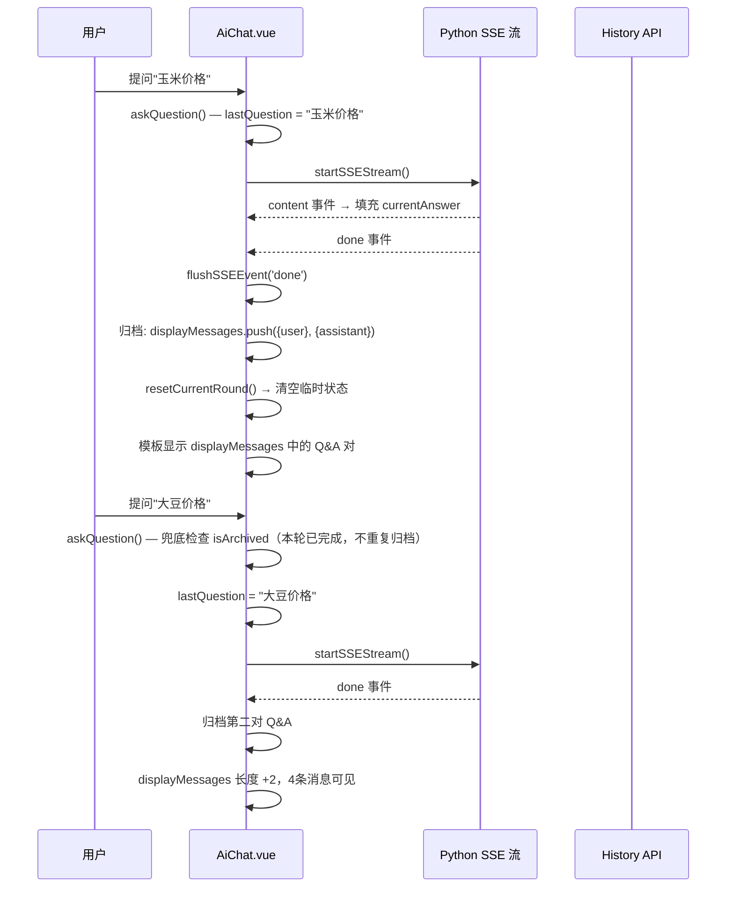

# AI 问答 — 会话内多轮对话历史累积（Phase 1 补全）

> **For agentic workers:** REQUIRED SUB-SKILL: Use superpowers:subagent-driven-development (recommended) or superpowers:executing-plans to implement this plan task-by-task. Steps use checkbox (`- [ ]`) syntax for tracking.

**Goal:** 同一会话内连续多轮提问时，之前的对话记录不会随新问题刷掉，用户可以像聊天 App 一样上下翻看所有历史问答。

**Architecture:** 纯前端改动，不涉及后端。利用已有的 SSE 事件流生命周期，在 `'done'` 事件中状态驱动地将当前轮 Q&A 对追加到 `displayMessages` 数组，替代此前仅依赖临时变量 `lastQuestion` + `currentAnswer` 展示的单轮模式。

**Tech Stack:** Vue 3 + TypeScript

---

## 问题分析

### 现状

当前架构中，对话消息分两层存储和展示：

| 层级 | 存储位置 | 来源 | 生命周期 |
|------|----------|------|----------|
| **持久层** | `displayMessages`（内存数组） | API 加载的 Redis 历史消息 | 会话切换时整体替换 |
| **临时层** | `lastQuestion` + `currentAnswer`（ref） | 当前进行中的 SSE 流 | 每次 `askQuestion()` 清空 |

每次新提问时 `askQuestion()` 将 `currentAnswer` 置空，上一轮的 Q&A 仅通过临时层显示，一旦开始新问答就从 UI 消失。`displayMessages` 从未接收新完成的 Q&A 对。

### 根因

SSE `'done'` 事件中只做了 `isLoading = false` 和计时器清理，没有将本轮 Q&A 追加到 `displayMessages`。

---

## 设计方案

### 状态标记驱动归档

新增布尔状态 `isArchived`，替代文本匹配，避免"重复问题被判定为已归档"的误判：

```
SSE 'done' 触发时：
  if (!isArchived && lastQuestion 非空):
    displayMessages.push({user 消息})
    displayMessages.push({assistant 消息 + sources})
    isArchived = true
  调用 resetCurrentRound() → 清空 lastQuestion/currentAnswer/sources/thoughts
```

### 消息结构

```typescript
interface DisplayMessage {
  role: 'user' | 'assistant'
  content: string
  id: string           // q-{timestamp}-0 / a-{timestamp}-1（同轮共用 ts）
  sources?: Source[]   // 助理消息携带的知识来源
}
```

ID 规则：同一问答对共用一个 `Date.now()` 时间戳，后缀 `-0`/`-1` 区分角色，单毫秒不会重复。

### 核心流程



### 四层防护（按优先级）

| 层级 | 位置 | 作用 |
|------|------|------|
| L1 正常归档 | `flushSSEEvent('done')` | 流正常结束时归档 Q&A |
| L2 兜底归档 | `askQuestion()` 入口 | 上一轮 SSE 异常结束时，新提问前强制归档 |
| L3 切换会话 | `handleSwitchSession()` | 先归档再替换 displayMessages |
| L4 异常重置 | `flushSSEEvent('error'/'abort')` | 异常时不归档，只清临时状态防脏数据 |

---

## 会话切换数据合并规则

| 操作 | 行为 |
|------|------|
| 切换会话 | 先把当前未归档临时问答兜底追加到 displayMessages → `resetCurrentRound()` → API 历史消息整体替换 `displayMessages` |
| 新建会话 | `displayMessages = []` → `resetCurrentRound()` → 生成新 `sessionId` |
| KeepAlive 恢复 | `displayMessages` 驻留内存，不受路由切换影响 |

规则说明：远端 API 数据 = 持久化历史；`displayMessages` 内存累积 = 本次打开页面新增的对话。切换会话以服务端持久化数据为准，本地临时未归档内容先落地再替换。

---

## 边界情况处理

| 场景 | 处理方式 |
|------|----------|
| 重复发送相同问题 | `isArchived` 状态驱动，与消息文本无关，不误判 |
| 连续快速点击提问 | `isLoading` 拦截，不重复发起请求 |
| SSE 中途断连/错误 | 不归档，`resetCurrentRound()` 清空临时状态 |
| 手动终止（abort） | 仅清临时状态，不归档 |
| 页面刷新 | `displayMessages` 重新从 API 加载 |
| 无 sources 场景 | `sources=[]/undefined` 时 MessageContent 兼容渲染 |
| 超长内容 | 追加后布局、滚动、样式不变 |

---

## 涉及文件

- **Modify:** `frontend/src/views/ai-chat/AiChat.vue`

仅修改一个文件，新增约 30 行逻辑代码（状态 + 归档逻辑 + 兜底 + 公共方法）。

---

## 验证用例

1. **连续提问**：提问"玉米价格" → 等待完成 → 提问"大豆价格" → 两条 Q&A 都可见（4条消息）
2. **重复相同问题**：提问两次相同问题，消息不丢失、不重复
3. **SSE 断连**：中断后状态正确重置，不残留脏数据
4. **快速连续点击**：`isLoading` 拦截，不重复发起请求
5. **切换会话**：会话 A 问 2 轮 → 切到 B 问 1 轮 → 切回 A → A 的 2 轮 + B 未污染
6. **新建会话 + 返回**：新会话为空 → 切回旧会话 → 旧会话消息完整
7. **页面刷新**：`displayMessages` 重新从 API 加载，不丢失
8. **无 sources 场景**：`sources=[]/undefined` 时 MessageContent 正常
